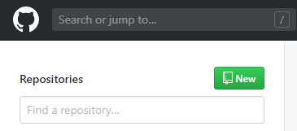
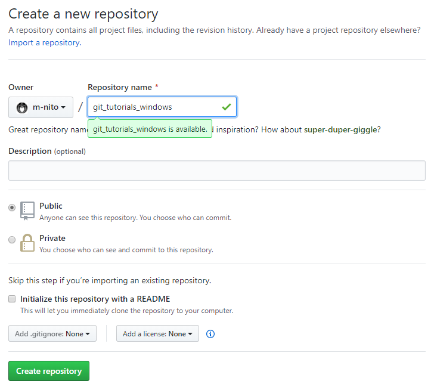
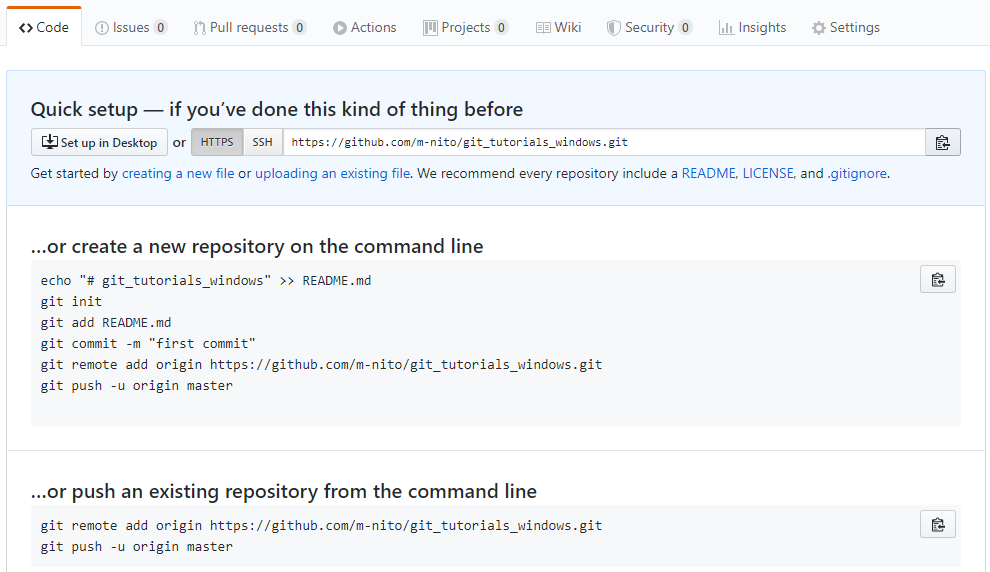

## `github` 利用チュートリアル
- ここでは `github` を利用して、自分のリポジトリをホスティングする方法を解説します。
- このチュートリアルを開始する前に `github` アカウントを作成し、ログインしておきます。

---

- [`github` にリポジトリを作成する](#github-%e3%81%ab%e3%83%aa%e3%83%9d%e3%82%b8%e3%83%88%e3%83%aa%e3%82%92%e4%bd%9c%e6%88%90%e3%81%99%e3%82%8b)
- [ローカルリポジトリを`github`にアップロードする](#%e3%83%ad%e3%83%bc%e3%82%ab%e3%83%ab%e3%83%aa%e3%83%9d%e3%82%b8%e3%83%88%e3%83%aa%e3%82%92github%e3%81%ab%e3%82%a2%e3%83%83%e3%83%97%e3%83%ad%e3%83%bc%e3%83%89%e3%81%99%e3%82%8b)
- [`README.md` を作成し、`github`にプッシュする](#readmemd-%e3%82%92%e4%bd%9c%e6%88%90%e3%81%97github%e3%81%ab%e3%83%97%e3%83%83%e3%82%b7%e3%83%a5%e3%81%99%e3%82%8b)
- [`github` 上で `README.md` を編集し、ローカルにプルする](#github-%e4%b8%8a%e3%81%a7-readmemd-%e3%82%92%e7%b7%a8%e9%9b%86%e3%81%97%e3%83%ad%e3%83%bc%e3%82%ab%e3%83%ab%e3%81%ab%e3%83%97%e3%83%ab%e3%81%99%e3%82%8b)

# `github` にリポジトリを作成する

- リポジトリ一覧の`New`ボタンを押下し、新規リポジトリを作成します。
- 
- リポジトリ作成画面が表示されるので、リポジトリ名を入力し、`Create repository` を選択します。
- 
  - `Public/Private` は、このリポジトリを公開する範囲を指定できます。
  - `Initialize this repository with a README` を有効にすると、`README.md` ファイルを作成します。
    - 今回はローカル側の`README.md`を利用するためオフにします。
  - `Add .gitignore` および `Add a license` も今回は省略します。

# ローカルリポジトリを`github`にアップロードする

- 前項で作成した空のリポジトリを確認すると、以下のように表示されます。
- 

  - 画面中央の手順のうち、`git remote add origin URL` の箇所をローカルで実行します。
    - このチュートリアルの URL ではなく、あなたのリポジトリの URL を指定するよう注意してください。
    - ローカルの`git`リポジトリに、この`github`リポジトリの URL がリモートリポジトリとして登録されます。
    - ここでは、リモートリポジトリに `origin` というタグを付与しています。
  - 続いて、`git push origin master`を実行します。
    - `push` コマンドは、ローカルリポジトリの内容をリモートリポジトリに送信します。
    - 送信が完了したなら、`github`のページを更新します。
      - ローカルリポジトリの内容が`github`にアップロードされていることが確認できます。
    - ローカルとリモートの内容に矛盾が存在する場合、`push`に失敗するので注意してください。
      - `.gitignore` の追加などを行わなかったのはこのためです。

- `git push --force origin master`
  - リモート(github)上のリポジトリを、ローカルの状態で強制的に上書きします。
  - ローカルに存在しない変更がリモートに存在する場合、それは永久に失われます。
  - 気軽に`--force`するクセをつけないよう注意してください。

# `README.md` を作成し、`github`にプッシュする

- ローカルリポジトリで、`README.md` ファイルを追加します。
  - 例として、`# TEST TEXT` という内容にし、コミットします。
  - ```bash
    echo "# TEST TEXT" > README.md
    git commit -am "Add README.md"
    ```
  - `Markdown` 形式のドキュメント記載方法についてはここでは解説しません。
  - このチュートリアルをはじめとした、`README.md` ファイルの実例を見ていくと理解が早いかと思います。
- この時点では、まだ`push`を行っていません。
  - そのため、`github`上のリポジトリを見ると、`Add README.md`コミットも、`README.md`ファイルも存在しないことが確認できます。
- 続いて、`git push origin master` を実行します。
  - `github` 上のリポジトリに、`README.md` ファイルが追加されたことが確認できます。
  - また `README.md` ファイルは、`github` では自動的に画面下部に表示されます。
    - そのため、このチュートリアルがそうであるように、静的ドキュメントの配置にも利用できます。

# `github` 上で `README.md` を編集し、ローカルにプルする
